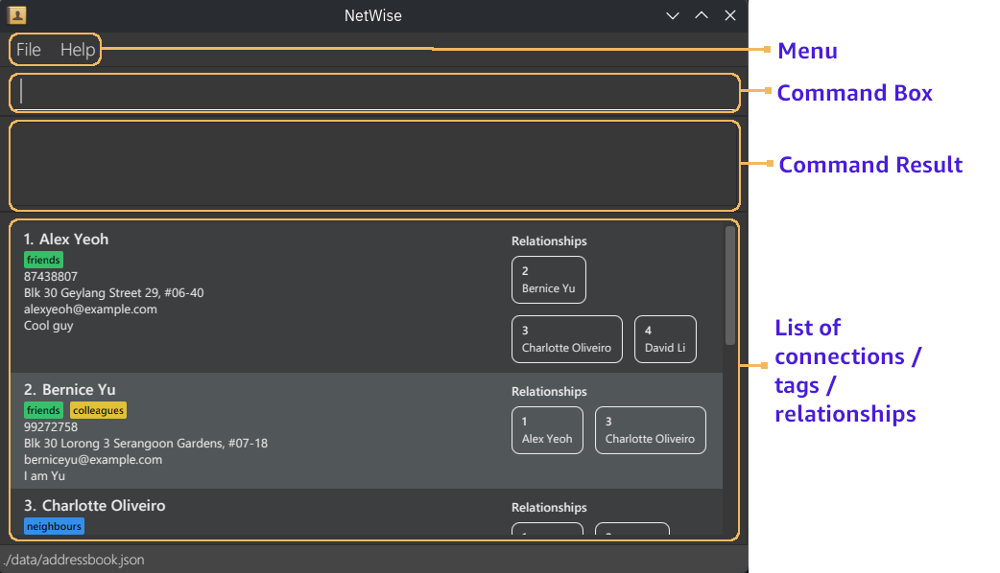

**NetWise** is your all-in-one networking companion, built **by and for Computer Science students**.
If you have a growing network of **friends, family, classmates, professors, and colleagues**,
NetWise helps you stay connected, organised, and intentional about your relationships.

With NetWise, you can:
* **Organise your connections effortlessly** using ***tags***, so you can group people by shared contexts
   like “Project Teammates,” “Mentors,” or “Friends from CS2103.”
* **Map out *relationships*** between people to understand how your network connects —
   whether it’s a classmate who knows your internship supervisor or a friend who introduced you to a recruiter.

Designed with **tech-savvy students** in mind, NetWise combines the **power of the Command Line Interface (CLI)**
with the **ease of a clean, compact Graphical User Interface (GUI)**. If you’re comfortable typing fast or
love the efficiency of terminal commands, you’ll feel right at home. Every command is optimised for speed
and simplicity — because your time is better spent connecting, not clicking.

Whether you’re building professional contacts, maintaining friendships, or networking your way up to your next FAANG
internship, **NetWise helps you keep your network strong — one command at a time**.

--------------------------------------------------------------------------------------------------------------------

## Table of Contents

* Table of Contents
{:toc}

--------------------------------------------------------------------------------------------------------------------

## Purpose of this guide

This user guide aims to familiarise you with the commands of NetWise and to use it effectively.

--------------------------------------------------------------------------------------------------------------------

## How to use this guide

 * There is a [Table of Contents](#Table-of-Contents) with clickable links above for easy nagivation.
 * For new user, please refer to [Quick Start](#Quick-Start) for instructions to install and run the app.
 * For details of all commands, please refer to [Features](#Features).
 * For experienced users, please refer to [Command Summary](#Command-Summary) for an overview of all commands.

--------------------------------------------------------------------------------------------------------------------

## Quick Start

1. Ensure you have Java `17` or above installed in your computer. \
   **Mac users:** Ensure you have the precise JDK version prescribed
   [here](https://se-education.org/guides/tutorials/javaInstallationMac.html).

2. Download the latest `NetWise.jar` file from [here](https://github.com/AY2526S1-CS2103T-T16-1/tp/releases).

3. Copy the file to the folder you want to use as the _home folder_ for NetWise.

4. Double-click the file to start the app. \
   A GUI similar to below should appear in a few seconds, with some sample connections.

   

#### UI Overview

1. **Menu** \
   A menu bar with clickable options.
2. **Command box** \
   This is where you type your commands.
   * Type a command into the command box and press Enter to execute it.
   * Some example commands you can try:
     * `list`: Lists all connections.
     * `add n/Minh p/12345678 e/minh@minh.com`: Adds a connection named Minh to NetWise.
     * `delete 3`: Deletes the connection with ID 3.
     * `exit`: Exits the app.
   * Refer to the [Features](#Features) below for details of each command.
3. **Command result** \
   Shows the response message from the app whenever a command is executed.
4. **List of connections / tags / relationshipss** \
   Shows a list of connections or tags or relationships, depending on what commands were executed.

**Tips**: UI is designed to work best at a minimum window size, allowing computer science students to
multitask while using NetWise

--------------------------------------------------------------------------------------------------------------------

## Features

**:information_source: Notes about the command format:** 

* Words in `UPPER_CASE` are the parameters to be supplied by the user. 
  e.g. in `add n/NAME`, `NAME` is a parameter which can be used as `add n/John Doe`.

* Items in square brackets are **optional**. 
  e.g `n/NAME [t/TAG_ID]` can be used as `n/John Doe t/1` or as `n/John Doe`.

* Items with `…`​ after them can be used **multiple times** including zero times. 
  e.g. `[t/TAG_ID]…​` can be used as ` ` (i.e. 0 times), `t/1`, `t/1 t/3` etc.

* Otherwose, items without any brackets or elipses are **compulsory** and **single-valued** field. 
  e.g. `n/NAME p/PHONE` means the use must put in a single value for each field, like `n/John Doe p/98765432`

* For all parameters, the slash character `/` is not allowed. \
  e.g. `edit 1 n/Batman S/O Superman` is not allowed, as there is a slash character in the name. For Indian names,
  an alternative solution is to type `S/O` as `S.O.`.

* Parameters can be in any order. 
  e.g. if the command specifies `n/NAME p/PHONE_NUMBER`, `p/PHONE_NUMBER n/NAME` is also acceptable.

* Extraneous parameters for commands that do not take in parameters (such as `help`, `list`, `exit` and `clear`) will be
  ignored. 
  e.g. if the command specifies `help 123`, it will be interpreted as `help`.

* If you are using a PDF version of this document, be careful when copying and pasting commands that span multiple lines
  as space characters surrounding line-breaks may be omitted when copied over to the application.

* **Disclaimer**: There are some examples of invalid commands along with explanations. However, the actual error message 
  displayed by NetWise may not mention the exact error. Please refer back to this User Guide for the detailed
  parameters' constraints.

### Viewing help : `help`

A pop-up help window will appear with the list of commands and their usage.

Format: `help`

* You can also access the help window by: pressing F1 key, or via the `Help` menu at the top of the application window.

### Adding a connection : `add`

Adds a connection to NetWise. A *connection* is someone who you want to keep in contact, such as
friends, colleagues or people you met from a networking event.

Format: `add n/NAME p/PHONE e/EMAIL [a/ADDRESS] [t/TAG_ID]…​ [r/NOTE]`

:bulb: **Tip:**
A connection can have any number of tags (including 0)

* `NAME` should only contain alphanumeric characters, commas, full-stops, apostrophes and spaces, and it must not be
  empty.
    * Name should be unique. The same name must not be repeated, case-sensitive (i.e. 'BEN' is different from 'ben').
* `PHONE` should only contain numbers, an *optional* plus `+` **at the start** for country code, and spaces or dashes 
  `-`.
* `EMAIL` should be of format `local-part@domain` and adhere to the following constraints:
    * `local-part` should only contain alphanumeric characters and these special characters: `+`, `-`, `.`, `_`. The
      local-part may not start or end with any special characters.
    * This is followed by a `@` and then a `domain`. The `domain` is made up of domain labels separated by periods `.`.
      There should be at least two domain labels, with the final domain label (i.e. `.com`, `.sg`, `.net`, etc.)
      should have at least 2 characters.
* `TAG_ID` refers to the **unique ID** of each tag (**not** their names), can be seen by using the
  [`listtag`](#listing-all-tags--listtag) command.
    * The tag ID **must be a positive integer** 1, 2, 3, …​
    * One user can be assigned multiple tag IDs, and these do not have to be in any order (i.e. `t/1 t/3` and `t/3 t/1`
      will both assign tags with IDs 1 and 3 to the connection).
* `NOTE` can accept any character input of any length.

Examples:

* `add n/John Doe p/+12 98765432 e/johnd@example.com.sg a/John street, block 123, #01-01`
* `add n/Betsy Crowe e/betsycrowe@example.com a/Newgate Prison p/123-456-789 t/1 r/She owed me lunch`,
  supposed tag with ID 1 has tag name `criminal`.

Examples of **invalid commands**:

* `add` — Reason: Reason: compulsory fields missing (`NAME`, `EMAIL` and `PHONE`).
* `add n/Peter e/pete@something.sg` - Reason: compulsory field missing (`PHONE`).
* `add n/David p/1234 5678 e/ a/Wall Street r/rich` — Reason: compulsory field empty (`EMAIL`).
* `add n/Natalie p/98765 e/nat@example.net t/friend` — Reason: invalid field input (`TAG_ID` should only be positive 
  integers).
* `add n/Mel p/+(12) 3456789 e/mel@example.sg` — Reason: invalid field input (`PHONE` should not contain brackets).
* `add n/Emma p/+13245678 e/emmaaa@example` — Reason: invalid field input (`EMAIL` must contain at least two domain 
  labels separated by periods `.`).

### Listing all connections : `list`

Shows a list of all connections in NetWise with easy view of relationships for each connection.

**Note:** List shows the **unique ID** given when the connection is created not the relative index in the list.

Format: `list`

### Editing a connection : `edit`

Edits an existing connection in NetWise.

Format: `edit ID [n/NAME] [p/PHONE] [e/EMAIL] [a/ADDRESS] [t/TAG_ID]…​ [r/NOTE]`

* Edits the connection with the specified `ID`.
* The `ID` refers to the **unique ID** each connection is given when created,
  can be seen with [`list`](#listing-all-connections--list).
    * The `ID` **must be a positive integer** 1, 2, 3, …​
* If the connection with the input `ID` does not exist in the list, expect a message informing that no person found.
* **At least ONE** field to edit (`n/`, `p/`, `e/`, `a/`, `t/`) must be provided and not empty.
* Further conditions for `NAME`, `PHONE`, `EMAIL`, `ADDRESS`, `TAG_ID`, and `NOTE` follows the same as in
  [`add`](#adding-a-connection--add).
* Existing values will be updated to the input values.
* When editing tags, the existing tags of the connection will be removed, i.e adding of tags is not cumulative.

:bulb: **Tip:**
You can remove all the connection’s tags by typing `t/` without specifying any tags after it.

Examples:

* `edit 1 p/91234567 e/johndoe@example.com` Edits the phone number and email address of the connection with ID 1
  to be `91234567` and `johndoe@example.com` respectively.
* `edit 2 n/Betsy Crower t/` Edits the name of the connection with ID 2 to be `Betsy Crower` and
  clears all existing tags.

Examples of **invalid commands**:

* `edit 1` — Reason: no field to be edit is provided. 
* `edit 2 n/` - Reason: invalid field input (`NAME` must not be empty).
* `edit 3 t/friend` — Reason: invalid field input (`TAG_ID` should only be positive integers).
* `edit n/John p/91325678` — Reason: no ID is provided.
* `edit 0 n/John p/91325678` — Reason: invalid ID provided (`ID` must be a positive integer).

### Deleting a connection : `delete`

Deletes the specified connection from NetWise.

Format: `delete ID`

* Deletes the connection with the specified `ID`.
* The `ID` refers to the **unique ID** each connection is given when created, can be seen with
  [`list`](#listing-all-connections--list).
* The `ID` **must be a positive integer** 1, 2, 3, …​
* If the connection with the input `ID` does not exist in the list, expect a message informing that no person found.

Examples:

* `list` followed by `delete 2` deletes the connection with ID 2 in NetWise.
* `find Betsy` followed by `delete 2` deletes the connection with ID 2 in the results of the `find` command.

Example of **invalid command**:

* `delete 0` — Reason: invalid ID provided (`ID` must be a positive integer).

### Locating connections by fields : `find`

Finds all connections (persons) whose specified fields contain any of the given keywords.
Matching is **case-insensitive** and supports **substring** (for most fields) and **word-based** (for tags) matching.

Format: `find [n/NAME_KEYWORDS]…​ [p/PHONE_KEYWORDS]…​ [e/EMAIL_KEYWORDS]…​ [a/ADDRESS_KEYWORDS]…​ 
[t/TAG_ID]…​`

* **At least ONE** field to find (`n/`, `p/`, `e/`, `a/`, `t/`) must be provided.
* Each field can take one or more keywords separated by spaces.
* Matching is partial for name, phone, email, and address (e.g., `n/Ali` matches “Alice”).
* Matching is exact (ID-based) for tags (e.g., `t/5` only matches tag with ID 5, **not** that contains the character 
"5").
* Unlike [`add`](#adding-a-connection--add) and [`edit`](#editing-a-connection--edit) commands, the keyword parameters
  does not have any input restrictions for flexibility.
* Empty input fields (i.e. `n/` or `p/    ` (whitespaces)) will **not** be taken into account when filtering for
  connections. However, at least one field provided must not be empty.
* The search across different fields uses **AND logic** — a person must match all fields provided.
  (e.g. `n/Ali e/gmail` finds persons whose **name contains “Ali”** *and* **email contains “gmail”**.)
* The search within the same field uses **OR logic** — any one of the field’s keywords will match.
  (e.g. `a/Clementi a/Bishan` finds persons living in *either* Clementi *or* Bishan.)
* **Note**: `find` does not support locating connections by *notes*.

Examples:

* `find n/Ali` → Finds all persons with names containing “Ali”.
* `find e/gmail a/Clementi` → Finds persons whose email contains “gmail” and address contains “Clementi”.
* `find n/Ali e/gmail a/Clementi a/Bishan t/2 t/5 t/7` → Finds persons who:
    * name contains “Ali”:
    * email contains “gmail”,
    * address contains “Clementi” or “Bishan”, and
    * has tag IDs 2, 5, or 7.

Example of **invalid command**:

* `find n/ p/` — Reason: no non-empty field is provided.

### Adding a tag : `addtag`

Adds a tag to NetWise. A tag is a keyword or label used to categorise and organise your connections.

Format: `addtag n/NAME [d/DESCRIPTION] [c/RGB_COLOR]`

* Add a tag into NetWise, along with an optional description and tag colour.
* `NAME` should only contain alphanumeric characters, and it must not be empty.
    * Name should be unique. The same name must not be repeated, case-sensitive (i.e. 'FRIEND' is different from
      'friend').
* `DESCRIPTION` can accept any character input of any length.
* The `RGB_COLOR` describe the colour you want to set for the tag.
* `RGB_COLOR` field *must* be a HEX colour string of length 6, case-insensitive, and must not be left empty if the
  prefix is included.
    * The string should be written ***without*** the hash ('#'), such as `123456`, `0F2AAB`, `abf1cd`, …​
* The default `DESCRIPTION` field is "No description" (if prefix is not included). Empty `DESCRIPTION` field
  (i.e. `d/`) will set the description to be empty.
* The default `RGB_COLOR` is gray (#808080) (if prefix is not included)
* The created tag will be assigned a **fixed and unique** *tag ID*, can be seen with the
  [`listtag`](#listing-all-tags--listtag) command.

Examples:

* `addtag n/JC d/JC friends c/23f1cd`
* `addtag n/CS2013T tP`

Examples of **invalid commands**:

* `addtag` — Reason: Reason: compulsory field missing (`NAME`).
* `addtag n/` — Reason: compulsory field empty (`NAME`).
* `addtag n/friends c/lightblue` — Reason: invalid field input
  (`RGB_COLOR` should be a 6-digit HEX code, **not** a color description).
* `addtag n/company c/` — Reason: invalid field input (`RGB_COLOR` should not be empty).
* `addtag n/cs2101 c/a1b2c3d4` — Reason: invalid field input (`RGB_COLOR` should be a 6-digit HEX code).

### Listing all tags : `listtag`

Shows a list of all tags in NetWise.

Format: `listtag`

* List all tags along with their description and assigned color.
* The tag list does not show tags in any particular order.
  It shows the tag name along with the associated **unique tag ID** given when the tag is created.

**Note:** List shows the **unique ID** given when the tag is created not the relative index in the list.

### Editing a tag : `edittag`

Edits a tag in NetWise.

Format: `edittag TAG_ID [n/NAME] [d/DESCRIPTION] [c/RGB_COLOR]`

* Edits the tag at the specified `TAG_ID`.
* `TAG_ID` refers to the **unique tag ID** each tag is given when created, can be seen with
  [`listtag`](#listing-all-tags--listtag).
    * `TAG_ID` **must be a positive integer** 1, 2, 3, …​
* If the tag with the input `TAG_ID` does not exist in the list, expect a message informing that no tag found.
* Further conditions for `NAME`, `DESCRIPTION`, and `RGB_COLOR` follows the same as in
  [`addtag`](#adding-a-tag--addtag).
* At least one of the optional fields must be provided.
* Existing values will be updated to the input values.

Examples:

* `edittag 1 d/my extended family c/099fca` changes the description of tag with ID 1 to "my extended family",
  and set its color to the color with hex code #099fca.
* `edittag 2 n/Prof d/` changes the name of tag with ID 2 to "Prof", set description to be empty.

Examples of **invalid commands**:

* `edittag 1` — Reason: no field to be edit is provided.
* `edittag 2 n/` - Reason: invalid field input (`NAME` must not be empty).
* `edittag 3 c/red` — Reason: invalid field input
  (`RGB_COLOR` should be a 6-digit HEX code, **not** a color description).
* `edittag 0 n/coworkers p/91325678` — Reason: invalid ID provided (`ID` must be a positive integer).

### Deleting a tag : `deletetag`

Deletes a tag from NetWise.

Format: `deletetag TAG_ID`

* Deletes the tag at the specified `TAG_ID`.
* `TAG_ID` refers to the **unique ID** each tag is given when created, can be seen with
  [`listtag`](#listing-all-tags--listtag).
    * `TAG_ID` **must be a positive integer** 1, 2, 3, …​
* If the tag with the input `TAG_ID` does not exist in the list, expect a message informing that no tag found.

Example:

* `delete 2` to delete the tag with ID 2

Example of **invalid command**:

* `delete 0` — Reason: invalid ID provided (`ID` must be a positive integer).

### Adding a relationship : `addrel`

Adds a relationship to NetWise. A *relationship* links any two connections together.

Format: `addrel p1/CONNECTION_1 p2/CONNECTION_2 d/DESCRIPTION`

* `CONNECTION_1` and `CONNECTION_2` refers to the unique IDs of the two connections that this relationship links.
    * `CONNECTION_1` and `CONNECTION_2` **must be a positive integer** 1, 2, 3, …​
    * `CONNECTION_1` and `CONNECTION_2` must be different (i.e. a person cannot have a relationship with themselves).
    * A connection is two-way. Therefore, the order of `CONNECTION_1` and `CONNECTION_2` are not important.
* If either, or both, of the connections `CONNECTION_1` and `CONNECTION_2` do not exist in the list, expect a message
  informing that no person is found.
* `DESCRIPTION` is a field to describe the relationship, e.g.: colleagues from ABC company
* `DESCRIPTION` can accept any character input of any length that contains at least 1 non-whitespace character.

Examples:

* `addrel p1/1 p2/2 d/childhood friends`. Adds a relationship between the connections with ID 1 and 2, noting
  that they are childhood friends.

Examples of **invalid commands**:

* `addrel p1/alice p2/3 d/couple` — Reason: invalid field input
  (`CONNECTION_1` should be the connection ID, not their name).
* `addrel p1/0 p2/3 d/couple` — Reason: invalid field input
  (`CONNECTION_1` must be a positive integer).
* `addrel p1/4 p2/5` — Reason: compulsory field missing (`DESCRIPTION`).
* `addrel p2/3 d/mentor` — Reason: compulsory field missing (`CONNECTION_1`).
* * `addrel p1/4 p2/5 d/` — Reason: invalid field input (`DESCRIPTION` should not be empty).

### Listing all relationships : `listrel`

Shows a list of relationships for each person in the list in NetWise.

Format (one person): `listrel p1/CONNECTION_1`: show a list of all person related to `CONNECTION_1`
along with the relationship info \

Format (two persons): `listrel p1/CONNECTION_1 p2/CONNECTION_2`: show the chain of relationships
between `CONNECTION_1` and `CONNECTION_2` (if exist), along with the relationship infos.

* `CONNECTION_1` and `CONNECTION_2` refers to the unique IDs of the two connections that this relationship links.
    * `CONNECTION_1` and `CONNECTION_2` **must be a positive integer** 1, 2, 3, …​
* If either, or both, of the connections `CONNECTION_1` and `CONNECTION_2` do not exist in the list,
  expect a message informing that no relationship is found.
* **Note**:
    1. Finding the chain of relationships between the same person will only show that person,
       even though a relationship cannot exist between the same person.
    2. If added a new person or relationship, you should use `listrel` again to reevaluate the relationship list shown.
       **However,** changes in fields (e.g. name, relationship description) do not require reevaluation of the
       relationship list.
    3. Shows the **unique ID** given when the connection is created not the relative index in the list.

Examples:

* `listrel p1/1`. Shows a list of connections who has a relationship to ID 1 and the description of their relationships.
* `listrel p1/1 p2/2`. Shows a list of relationships in order to see how connection with ID 1
  may be connected to connection with ID 2 via a chain of relationships. If there are multiple of such chains,
  only the shortest one will be shown.

Examples of **invalid commands**:

* `listrel p1/alice` — Reason: invalid field input (`CONNECTION_1` should be the connection ID, not their name).
* `listrel p1/0 p2/3` — Reason: invalid field input (`CONNECTION_1` must be a positive integer).

### Editing a relationship : `editrel`

Edits the description of a relationship in NetWise.

Format: `editrel p1/CONNECTION_1 p2/CONNECTION_2 d/DESCRIPTION`

* Edits the relationship between p1 and p2. `editrel` will edit the description of the relationship between p1 and p2.
* All fields must be provided.
* `CONNECTION_1` and `CONNECTION_2` refers to the unique IDs of the two connections that this relationship links.
    * `CONNECTION_1` and `CONNECTION_2` **must be a positive integer** 1, 2, 3, …​
    * `CONNECTION_1` and `CONNECTION_2` must be different (i.e. a person cannot have a relationship with themselves).
* If either, or both, of the connections `CONNECTION_1` and `CONNECTION_2` do not exist in the list,
  expect a message informing that no relationship is found.

Examples:

* `editrel p1/1 p2/2 d/highschool friends`. Edits the description of the relationship between connection ID 1 and
  connection ID 2.

Examples of **invalid commands**:

* `editrel p1/alice p2/3 d/couple` — Reason: invalid field input
  (`CONNECTION_1` should be the connection ID, not their name).
* `editrel p1/0 p2/3 d/couple` — Reason: invalid field input
  (`CONNECTION_1` must be a positive integer).
* `editrel p1/4 p2/5` — Reason: compulsory field missing (`DESCRIPTION`).
* `editrel p2/3 d/mentor` — Reason: compulsory field missing (`CONNECTION_1`).
* `editrel p1/4 p2/5 d/` — Reason: invalid field input (`DESCRIPTION` should not be empty).

### Deleting a relationship : `deleterel`

Deletes a relationship from NetWise.

Format: `deleterel p1/CONNECTION_1 p2/CONNECTION_2`

* Deletes the relationship between p1 and p2.
* * `CONNECTION_1` and `CONNECTION_2` refers to the unique IDs of the two connections that this relationship links.
    * `CONNECTION_1` and `CONNECTION_2` **must be a positive integer** 1, 2, 3, …​
* If either, or both, of the connections `CONNECTION_1` and `CONNECTION_2` do not exist in the list,
  expect a message informing that no relationship is found.

Examples:

* `deleterel p1/1 p2/2`. Deletes the relationship between connection ID 1 and connection ID 2.

Examples of **invalid commands**:

* `deleterel p1/alice p2/3` — Reason: invalid field input (`CONNECTION_1` should be the connection ID, not their name).
* `deleterel p1/0 p2/3` — Reason: invalid field input (`CONNECTION_1` must be a positive integer).
* `deleterel p1/4` — Reason: compulsory field missing (`CONNECTION_2`).

### Clearing everything : `clear`

Clears all connections, tags and relationships from NetWise. **Resets the indexes of connections and tags to the initial
state.**

Format: `clear`

### Exiting the program : `exit`

Exits the program.

Format: `exit`

* You can also access the exit command by via pressing `File` menu and `Exit` at the top of the application window.

### Navigate through command history using up/down arrow

Using the up/down arrow keys, user can navigate through their command history, displaying the commands on the command
line.

* **Up Arrow Key**: Cycle backward through previously executed commands.
* **Down Arrow Key**: Cycle forward through the command history, moving from older commands to more recent ones that
  have already been displayed using the up arrow key.

### Saving the data

NetWise data are saved in the hard disk automatically after any command that changes the data.
There is no need to save manually.

### Editing the data file

NetWise data are saved automatically as a JSON file `[JAR file location]/data/addressbook.json`.
Advanced users are welcome to update data directly by editing that data file.

:exclamation: **Caution:**
If your changes to the data file makes its format invalid, NetWise will discard all data and start with an
empty data file at the next run. Hence, it is recommended to take a backup of the file before editing it.
 
Furthermore, certain edits can cause NetWise to behave in unexpected ways
(e.g., if a value entered is outside of the acceptable range).
Therefore, edit the data file only if you are confident that you can update it correctly.

--------------------------------------------------------------------------------------------------------------------

## FAQ

**Q**: How do I transfer my data to another Computer? 
**A**: Install the app in the other computer and overwrite the empty data file it creates with the file that
contains the data of your previous NetWise home folder.

--------------------------------------------------------------------------------------------------------------------

## Known issues

1. **When using multiple screens**, if you move the application to a secondary screen, and later switch to using
   only the primary screen, the GUI will open off-screen. The remedy is to delete the `preferences.json` file created
   by the application before running the application again.
2. **If you minimize the Help Window** and then run the `help` command (or use the `Help` menu, or the
   keyboard shortcut `F1`) again, the original Help Window will remain minimized, and no new Help Window will appear.
   The remedy is to manually restore the minimized Help Window.
3. Currently, when a person or tag is deleted, **the unique IDs of remaining entries remain unchanged** to maintain
   consistency of data, which can lead to gaps in the shown index. However, index of person and tags can be reset after
   using the `clear` command.

--------------------------------------------------------------------------------------------------------------------

## Command Summary

| Action                  | Format and Examples                                                                                                                                                                    |
|-------------------------|----------------------------------------------------------------------------------------------------------------------------------------------------------------------------------------|
| **Help**                | `help`                                                                                                                                                                                 |
| **Add connection**      | `add n/NAME p/PHONE_NUMBER e/EMAIL [a/ADDRESS] [t/TAG_ID]…​ [r/NOTE]`   e.g., `add n/James Ho p/22224444 e/jamesho@example.com a/123, Clementi Rd, 1234665 t/1 t/2 r/owes me lunch` |
| **List connections**    | `list`                                                                                                                                                                                 |
| **Edit connection**     | `edit ID [n/NAME] [p/PHONE_NUMBER] [e/EMAIL] [a/ADDRESS] [t/TAG_ID]…​ [r/NOTE]`  e.g.,`edit 2 n/James Lee e/jameslee@example.com`                                                   |
| **Delete connection**   | `delete ID`  e.g., `delete 3`                                                                                                                                                       |
| **Find connection**     | `find [n/NAME_KEYWORDS]…​ [p/PHONE_KEYWORDS]…​ [e/EMAIL_KEYWORDS]…​ [a/ADDRESS_KEYWORDS]…​ [t/TAG_ID]…`  e.g., `find n/James n/Jake`                                                |
| **Add tag**             | `addtag n/NAME [d/DESCRIPTION] [c/RGB_COLOR]`   e.g. `addtag n/JC d/JC friends c/23f1cd`                                                                                            |
| **List tags**           | `listtag`                                                                                                                                                                              |
| **Edit tag**            | `edittag ID [n/NAME] [d/DESCRIPTION] [c/RGB_COLOR]`   e.g. `edittag 1 d/my extended family c/099fca`                                                                                |
| **Delete tag**          | `deletetag ID`   e.g. `deletetag 2`                                                                                                                                                 |
| **Add relationship**    | `addrel p1/CONNECTION_1 p2/CONNECTION_2 d/DESCRIPTION`   e.g. `addrel p1/1 p2/2 d/friends`                                                                                          |
| **List relationships**  | `listrel p1/CONNECTION_1 [p2/CONNECTION_2]`    e.g. `listrel p1/1 p2/4`                                                                                                             |
| **Edit relationship**   | `editrel p1/CONNECTION_1 p2/CONNECTION_2 d/DESCRIPTION`   e.g. `editrel p1/1 p2/2 d/enemies`                                                                                        |
| **Delete relationship** | `deleterel p1/CONNECTION_1 p2/CONNECTION_2`   e.g. `deleterel p1/1 p2/2`                                                                                                            |
| **Clear everything**    | `clear`                                                                                                                                                                                |
| **Exit program**        | `exit`                                                                                                                                                                                 |
