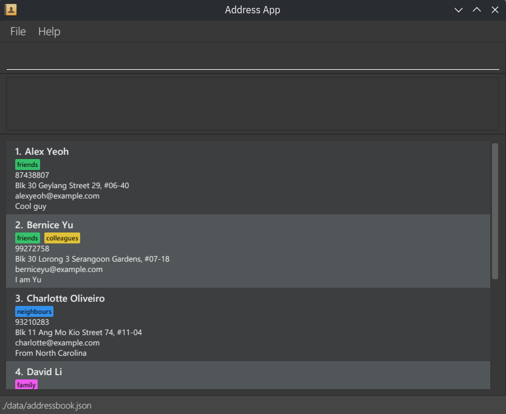

**NetWise** is your all-in-one networking companion, built **by and for Computer Science students**.
If you have a growing network of **friends, family, classmates, professors, and colleagues**,
NetWise helps you stay connected, organised, and intentional about your relationships.

With NetWise, you can:
* **Organise your connections effortlessly** using **tags**, so you can group people by shared contexts
   like “Project Teammates,” “Mentors,” or “Friends from CS2103.”
* **Map out relationships** between people to understand how your network connects —
   whether it’s a classmate who knows your internship supervisor or a friend who introduced you to a recruiter.

Designed with **tech-savvy students** in mind, NetWise combines the **power of the Command Line Interface (CLI)**
with the **ease of a clean, compact Graphical User Interface (GUI)**. If you’re comfortable typing fast or
love the efficiency of terminal commands, you’ll feel right at home. Every command is optimised for speed
and simplicity — because your time is better spent connecting, not clicking.

Whether you’re building professional contacts, maintaining friendships, or networking your way up to your next FAANG
internship, **NetWise helps you keep your network strong — one command at a time**.

* If you are interested in using NetWise, head over to the [_Quick Start_ section of the **User Guide**](UserGuide.html#quick-start).
* If you are interested about developing NetWise, the [**Developer Guide**](DeveloperGuide.html) is a good place to start.

**Acknowledgements**

* Libraries used: [JavaFX](https://openjfx.io/), [Jackson](https://github.com/FasterXML/jackson), [JUnit5](https://github.com/junit-team/junit5)
